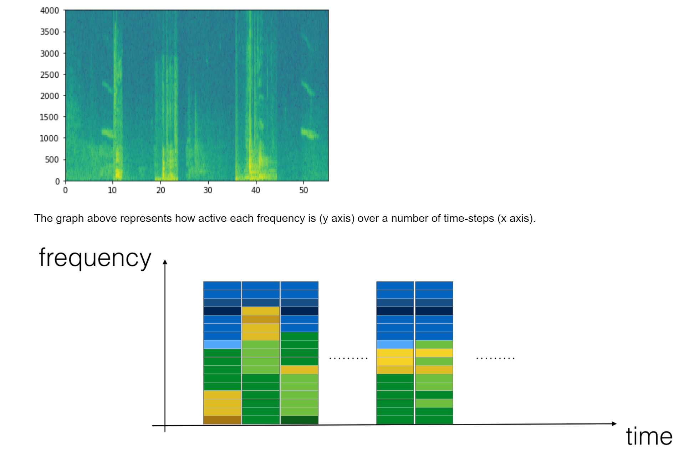
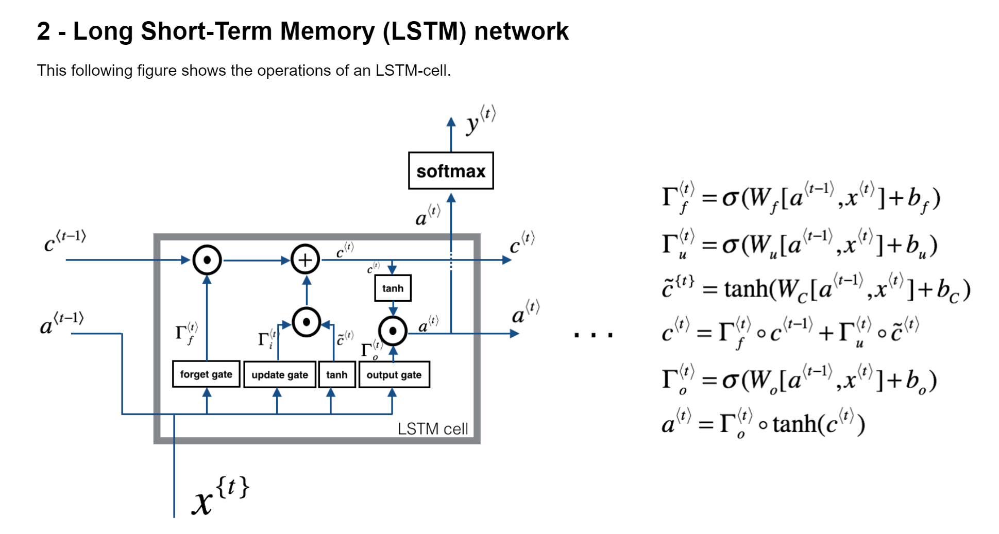

# Image Processing Masks-Convolution

Developing from Scratch Filters that change Images and apply them via Convolution With the purpose to Uderstand the Basics of Image Processing - Originally developed 04/05/2018

## In this project it was developed 
1. A function 

